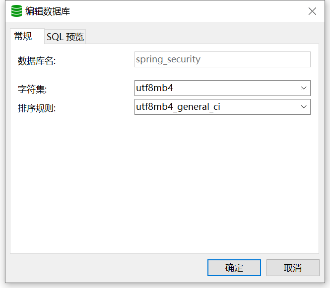
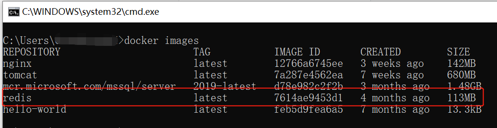
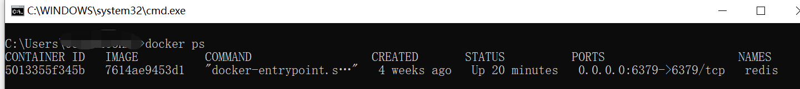
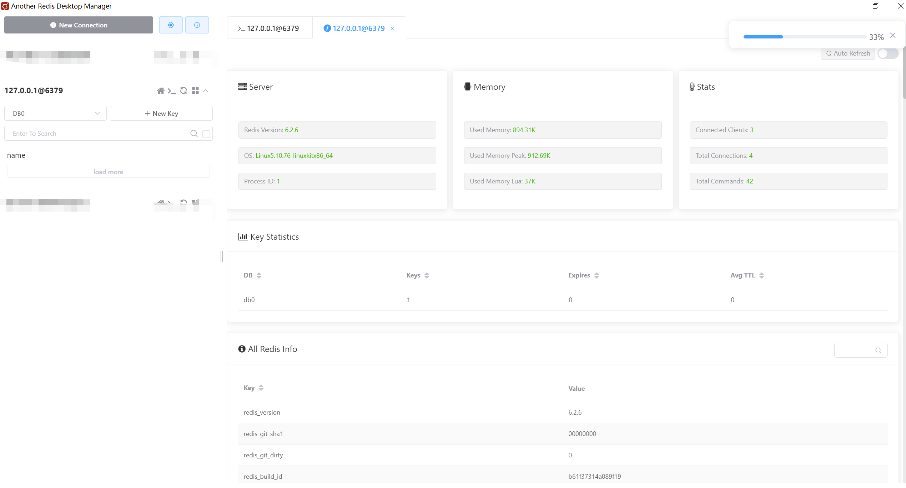
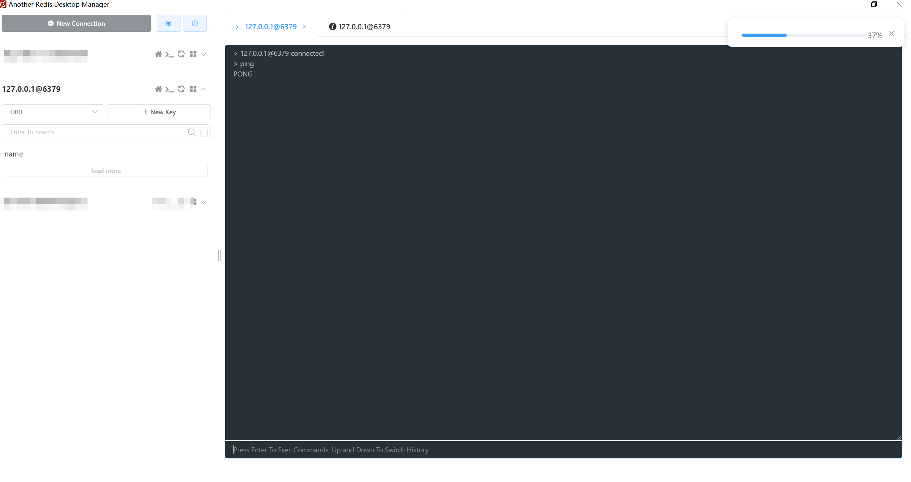

# hello-spring-security-token

## 准备工作

### MySQL

1. 建库

   

2. 建表

   ```sql
   CREATE TABLE `sys_user` (
     `id` bigint(20) NOT NULL AUTO_INCREMENT COMMENT '主键',
     `user_name` varchar(64) NOT NULL DEFAULT 'NULL' COMMENT '用户名',
     `nick_name` varchar(64) NOT NULL DEFAULT 'NULL' COMMENT '昵称',
     `password` varchar(64) NOT NULL DEFAULT 'NULL' COMMENT '密码',
     `status` char(1) DEFAULT '0' COMMENT '账号状态（0正常 1停用）',
     `email` varchar(64) DEFAULT NULL COMMENT '邮箱',
     `phonenumber` varchar(32) DEFAULT NULL COMMENT '手机号',
     `sex` char(1) DEFAULT NULL COMMENT '用户性别（0男，1女，2未知）',
     `avatar` varchar(128) DEFAULT NULL COMMENT '头像',
     `user_type` char(1) NOT NULL DEFAULT '1' COMMENT '用户类型（0管理员，1普通用户）',
     `create_by` bigint(20) DEFAULT NULL COMMENT '创建人的用户id',
     `create_time` datetime DEFAULT NULL COMMENT '创建时间',
     `update_by` bigint(20) DEFAULT NULL COMMENT '更新人',
     `update_time` datetime DEFAULT NULL COMMENT '更新时间',
     `del_flag` int(11) DEFAULT '0' COMMENT '删除标志（0代表未删除，1代表已删除）',
     PRIMARY KEY (`id`)
   ) ENGINE=InnoDB AUTO_INCREMENT=2 DEFAULT CHARSET=utf8mb4 COLLATE=utf8mb4_0900_ai_ci COMMENT='用户表';
   ```

3. 初始化数据

   ```sql
   
   ```

4. xxx

### Redis

**docker 方式安装**

1. 获取镜像

   ```shell
   docker pull redis:latest
   ```

   

2. 启动容器

   ```shell
   docker run -itd --name redis -p 6379:6379 redis:latest
   ```

   

3. 测试容器是否启动成功

   * 通过`Another Redis Desktop Manager` 连接

     

     

   * 通过容器连接

     ```shell
     docker exec -it redis /bin/bash
     redis-cli
     ping
     ```

     

   

### Postman

