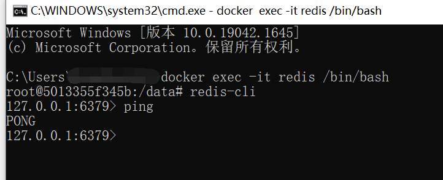

# hello-spring-security-token

## 准备工作

### MySQL

1. 建库

   

2. 建表

   ```sql
   CREATE TABLE `sys_user` (
     `id` bigint(20) NOT NULL AUTO_INCREMENT COMMENT '主键',
     `user_name` varchar(64) NOT NULL DEFAULT 'NULL' COMMENT '用户名',
     `nick_name` varchar(64) NOT NULL DEFAULT 'NULL' COMMENT '昵称',
     `password` varchar(64) NOT NULL DEFAULT 'NULL' COMMENT '密码',
     `status` char(1) DEFAULT '0' COMMENT '账号状态（0正常 1停用）',
     `email` varchar(64) DEFAULT NULL COMMENT '邮箱',
     `phonenumber` varchar(32) DEFAULT NULL COMMENT '手机号',
     `sex` char(1) DEFAULT NULL COMMENT '用户性别（0男，1女，2未知）',
     `avatar` varchar(128) DEFAULT NULL COMMENT '头像',
     `user_type` char(1) NOT NULL DEFAULT '1' COMMENT '用户类型（0管理员，1普通用户）',
     `create_by` bigint(20) DEFAULT NULL COMMENT '创建人的用户id',
     `create_time` datetime DEFAULT NULL COMMENT '创建时间',
     `update_by` bigint(20) DEFAULT NULL COMMENT '更新人',
     `update_time` datetime DEFAULT NULL COMMENT '更新时间',
     `del_flag` int(11) DEFAULT '0' COMMENT '删除标志（0代表未删除，1代表已删除）',
     PRIMARY KEY (`id`)
   ) ENGINE=InnoDB AUTO_INCREMENT=2 DEFAULT CHARSET=utf8mb4 COLLATE=utf8mb4_0900_ai_ci COMMENT='用户表';
   ```

3. 初始化数据

   ```sql
   
   ```

4. xxx

### Redis

**docker 方式安装**

1. 获取镜像

   ```shell
   docker pull redis:latest
   ```

   

2. 启动容器

   ```shell
   docker run -itd --name redis -p 6379:6379 redis:latest
   ```

   

3. 测试容器是否启动成功

   * 通过`Another Redis Desktop Manager` 连接

     

     

   * 通过容器连接

     ```shell
     docker exec -it redis /bin/bash
     redis-cli
     ping
     ```

     

   

### Postman

### jwt

#### 是什么

### 拦截器 过滤器

#### [拦截器（Interceptor）和过滤器（Filter）的执行顺序和区别](https://blog.csdn.net/zxd1435513775/article/details/80556034)


#### [spring 拦截器（Interceptor）和过滤器（Filter）的执行顺序和区别](https://blog.csdn.net/qianhuan_/article/details/107406100)


区别：

①拦截器是基于java的反射机制的，而过滤器是基于函数回调。

②拦截器不依赖与servlet容器，过滤器依赖与servlet容器。

③拦截器只能对action请求起作用，而过滤器则可以对几乎所有的请求起作用。

④拦截器可以访问action上下文、值栈里的对象，而过滤器不能访问。

⑤在action的生命周期中，拦截器可以多次被调用，而过滤器只能在容器初始化时被调用一次

#### [面向切面（Spring Aop）、拦截器、过滤器的区别](https://www.pianshen.com/article/5332798685/)

Filter过滤器：拦截web访问url地址。
Interceptor拦截器：拦截以 .action结尾的url，拦截Action的访问。
Spring AOP拦截器：只能拦截Spring管理Bean的访问（业务层Service）

Filter与Interceptor联系与区别
1. 拦截器是基于java的反射机制，使用代理模式，而过滤器是基于函数回调。
2. 拦截器不依赖servlet容器，过滤器依赖于servlet容器。
3. 拦截器只能对action起作用，而过滤器可以对几乎所有的请求起作用（可以保护资源）。
4. 拦截器可以访问action上下文，堆栈里面的对象，而过滤器不可以。
5. 执行顺序：过滤前-拦截前-Action处理-拦截后-过滤后。

